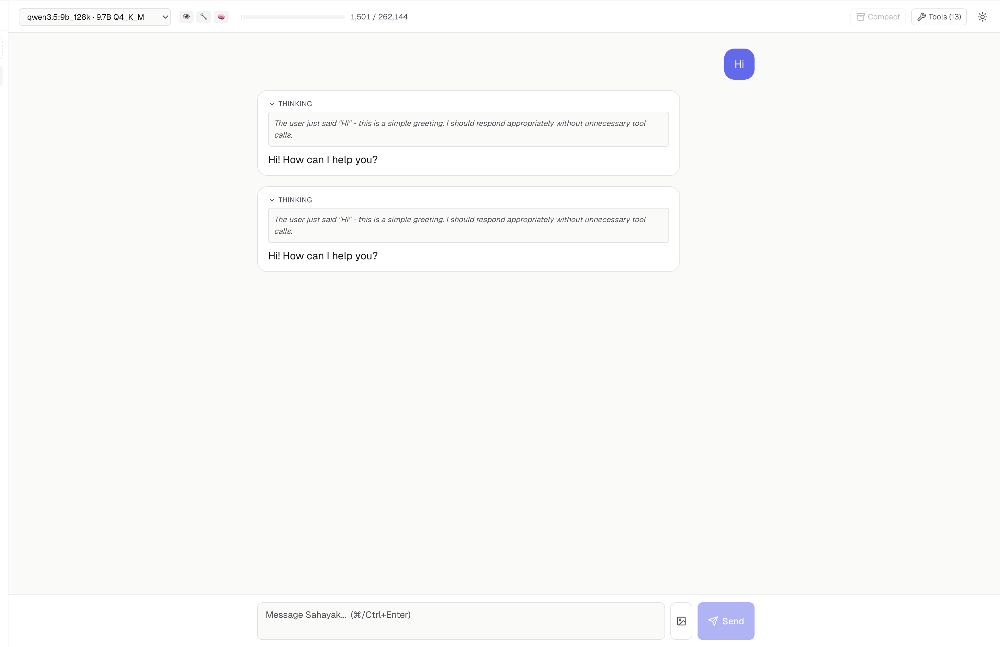
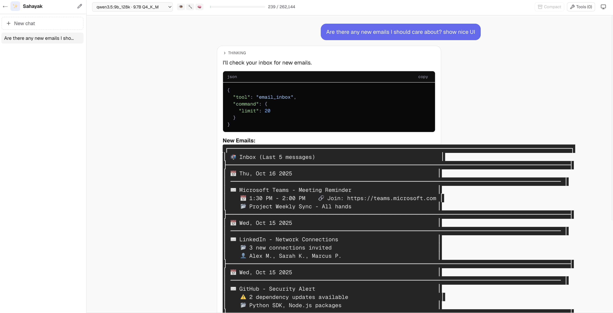
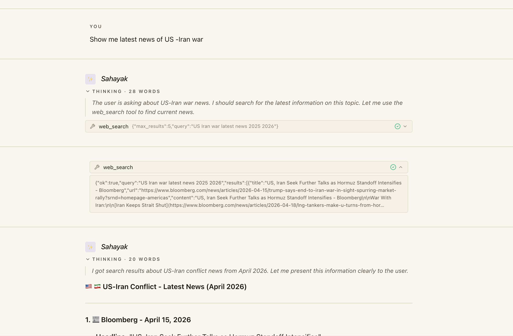
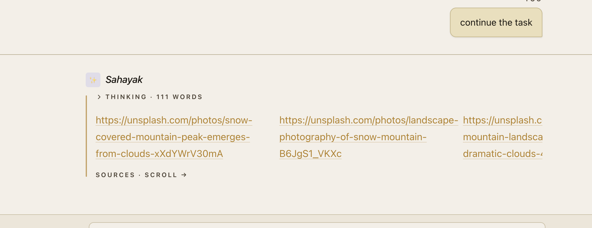

# Sahayak

Local-first AI chat with interactive artifacts, cross-session memory, and three hand-designed themes. No cloud, no API keys, your data never leaves your machine.



## Why Sahayak

- **Local-first.** Runs against [Ollama](https://ollama.com) or [llama.cpp](https://github.com/ggerganov/llama.cpp) on your machine. No keys, no quotas, no telemetry. Your sessions live in `.data/` as plain JSONL — back them up, grep them, move them between machines.
- **Multi-backend.** Same chat surface, swap engines per assistant: local llama.cpp (gguf files), local Ollama, or hosted Ollama Cloud (Kimi, MiniMax, GLM, etc.). Each assistant configures its own model and provider.
- **Interactive artifacts.** Models can emit real React components — Recharts dashboards, filterable tables, rendered SVG, maps — sandboxed in an iframe. The "**Build me a stock analysis dashboard with candlesticks**" workflow is an artifact, not a markdown screenshot of one.
- **MCP-aware.** Bring your own tool servers via the [Model Context Protocol](https://modelcontextprotocol.io). Configure once in `.config/mcp.json`, they appear in the assistant editor like any built-in tool.

## 60-second install

Prerequisites: Node 20+, Python 3.11+, [Ollama](https://ollama.com/download) running locally on port 11434.

```bash
git clone https://github.com/<your-fork>/sahayak && cd sahayak
npm install
npm run setup:python   # Creates .data/.venv with pandas/numpy/yfinance/...
```

Pull a tool-capable model and the embedding model used by memory:

```bash
ollama pull qwen3.5:9b           # any tool-capable model works
ollama pull nomic-embed-text     # for the memory subsystem
```

Run:

```bash
npm run dev    # http://localhost:9999
```

Detail (Windows / Apple Silicon / API keys / hosted Ollama Cloud / MCP) lives in [docs/getting-started.md](docs/getting-started.md).

## What's in the box

- **Chat surface** — streaming with reasoning, tool-result cards, regenerate, compaction, export to markdown.
- **[Artifacts](docs/artifacts.md)** — React components rendered in a sandboxed iframe; data flows from the session via `Sahayak.fetchData()`.
- **[Templates](docs/templates.md)** — pre-canned response shapes (news digest, itinerary, scorecard); the model fills in JSON, the renderer styles it.
- **[Memory](docs/memory.md)** — auto-recalled per turn, dedup at write, three types (fact / preference / procedural); inspectable via `cat .config/memory.jsonl | jq`.
- **Tool surface** — filesystem (read / write / search), shell with auto-prefixed Python venv, web search/fetch, Gmail (optional), MCP servers.
- **Themes** — three hand-designed styles × light/dark, switchable at runtime.
- **Single-user JSONL storage** — one file per session, inspectable with `cat | jq`. No DB.

## Screenshots

| | |
|---|---|
|  |  |
| Default theme. Reasoning trace expanded inline alongside the response. | Editorial theme. Gmail `email_inbox` tool call with structured inbox result. |
|  |  |
| Editorial theme. `web_search` for breaking news; thinking + tool result + formatted summary. | Editorial theme. Inline source citation strip rendered below the assistant response. |

> More screenshots — artifact panel, memory page, settings, mobile bottom-sheet — coming in a follow-up commit.

## Stack

[Next.js 16](https://nextjs.org) App Router (Turbopack) · React 19 · TypeScript · [Tailwind 4](https://tailwindcss.com) (CSS-first tokens) · [`pi-agent-core`](https://github.com/mariozechner/pi-agent-core) for the LLM loop · `react-markdown` + [Shiki](https://shiki.style) for prose rendering · JSONL persistence.

See [docs/architecture.md](docs/architecture.md) for the data model and tool plumbing.

## License

MIT. PRs welcome — file an issue first for anything non-trivial so we can talk shape before you write code.
